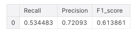
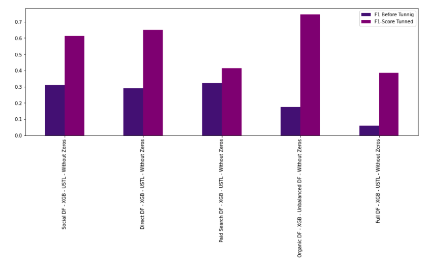
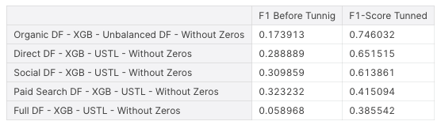
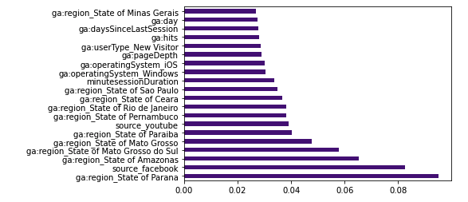
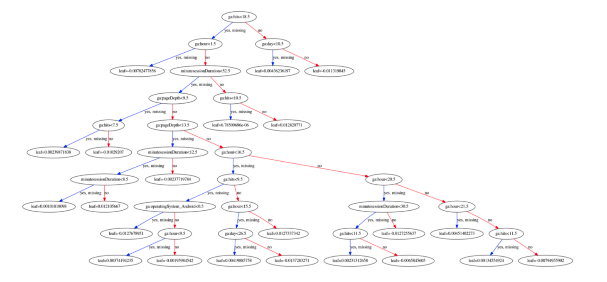

# Google Analytics-API - Ecommerce - Binary Classification - Transactions - Project Overview

## Motivation 
We saw that each traffic medium has particularities and that split the data based on the traffic sources can help us to get better analyses. For that reason, I am going to do a few tests to find the best splitting, balancing, and classification algorithm to find the best transaction predictor for each traffic medium. 
Then, we will be able to visualize the best decision tree for each traffic source, which can help any eCommerce to understand what is the usual behavior and profile of the customer more likely to buy. In that way, the project can help the marketing team define strategies to reach more customers with the best profile for each traffic medium.

## Overview
* Tested 42 different methods to predicate the transaction, tune the best method and plot the decision tree
* Four functions were built to split the dfs in train and test. Raw split, without zeros (without bounce rate), without outliers, without zeros and outliers.
 * Also was built three functions for the **Resampling Strategies**. **Random Under Sample**, **Random Over Sample**, and **Tomek Links**. 
* Then, the main function was built that tested all these variations into three different classification algorithms: **DecisionTreeClassifier**, **RandomForestClassifier**, **Extreme Gradient Boosting**. 
* Using **Hyperopt** I will tune the best model found by the previous function of each traffic medium and plot the feature importance and the best decision tree.

## Resources Used
**Python Version**: 3.7 
**Packages**: pandas, numpy, seaborn, matplotlib, sklearn, imblearn, xgboost, hyperopt, joblib
 
## Data Cleaning 
After importing the data already cleaned and organized at [Exploratory Analysis](https://github.com/varelaerick/Google-Analyts-API-Ecommerce-Exploratory-Data-Analysis-Proj) I will drop split the df per medium and drop 'medium', 'ga:transactionRevenue' and 'ga:itemQuantity' to avoid data leakage. Then I converted the categorical variables into dummy/indicator variables.

## Functions 
In that section will define a few functions that will be called by the main function (Model Test). The functions are as follows.
* **The Data Split Formats** - Functions will return the train and test split of the raw split, without zeros (without bounce rate), without outliers,  without zeros, and outliers.
* **Resampling Strategies Splitting** - Functions will return the train data set balanced with three different methods. Random Under Sampler, Random Over Sampler, and TokenLink Under Sampling.
* **Evaluate Metrics**- Function to return three the Precision and Recall and F1-Score of the models.
* **Model Test (Main Function)** - Will return a table with the recall precision and f1-score based on the test set Raw Data for the 48 different models. Return example:
 
## Result of Methods Evaluation
After running the function through all the dfs, in that section I create tables that show the top 5 methods per DF, and the best method per DF based on F1-Score. 

 

## Tuning Best Models
To tune the best methods I will use hyperopt library to find the best parameters for max_depth, learning_ratte, and n_esttimators. Next, I train the model with the parameters, plot confusion_matrix for transactions and not transactions, and define a new DF with the Precision-Recall and F1-Score.
 

 

 

 

 
 
Then, I will present a table and plot the results for each of the methods before and after the tuning.
 

 

 

 

## Feature Importance and Decision Tree Plot

Finally, I will plot the feature importance
 

 

 
and the decision tree and for each traffic medium. 
 

 

 
 

## Conclusion and future improvements. 
The project accomplished the main objective that was to find the best method to build models for each traffic medium of that eCommerce and present a decision tree for each of them.
 
Since it was my first machine learning project, I'm proud to do such a confusing thing haha. However, now I can see a lot of things to improve, such as:

* Better organization and explanation about sections.
* Transformation & Scaling the features
* Use Accuracy as one of the Evaluate Metrics
* Change the Tomek link to NearMiss under-sample.
* Build a pipeline for the tunning.
* Plot the decision rules for a better understanding of the tree.
* Show the entropy for transaction and not transaction.
* Present the best profile of the customer per traffic medium.

It will be updated as soon as possible.
 
Author: Erick C. Varela  
Date: 3/10/2020
 
 
 

## For the full dynamic visualizations:

### [See The Kernel On Kaggle](https://www.kaggle.com/erickvarela/ga-api-classification-ecommerce-transactions)

### [Or On Nbviewer](https://nbviewer.jupyter.org/github/varelaerick/Google-Analytics-API-Ecommerce-Binary-Classification-Transactions/blob/main/ga-api-classification-ecommerce-transactions.ipynb)
